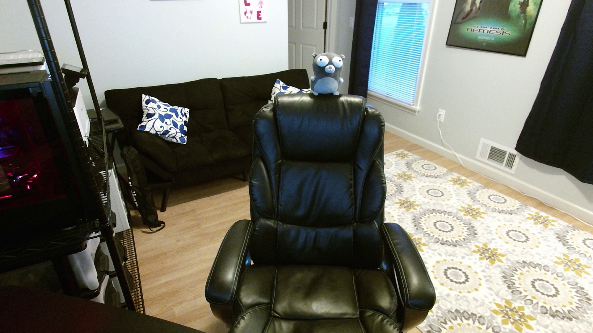

# kinect2pipe
A small application for piping output from libfreenect2 to a v4l2loopback device so the Kinect 2 can be used as a webcam
in Linux.

The [original Kinect for Xbox driver](https://github.com/torvalds/linux/blob/master/drivers/media/usb/gspca/kinect.c)
for Linux essentially exposes the raw RGB video stream from the Kinect. This worked well for the original Kinect because
the video formats were widely supported by V4L2 clients. The Kinect 2 on the other hand emits JPEG frames. There is
a [Kinect 2 kernel module](https://github.com/yoshimoto/gspca-kinect2) that works well but most clients don't support
the MJPEG format which makes the module of limited use with mainstream applications.

It seemed like a bad idea to do JPEG parsing and colorspace conversions in a kernel module and the v4l2loopback is a
stable kernel module that allows clients to do their work in userspace while still providing a standard V4L2 interface.

This application uses the [libfreenect2](https://github.com/OpenKinect/libfreenect2) library to connect to the Kinect 2
and get RGB color frames and then uses [libswscale](https://ffmpeg.org/libswscale.html) to perform a colorspace
conversion to YUV420 which is a much more generally supported format by v42l clients. Since JPEG decoding is a CPU
intensive operation the application will only start the stream when client applications open a file handle to the
v4l2loopback device and will close the video stream when all handles are closed.

## Compiling

You will need to have installed the `libswscale5` and `libfreenect2` packages in order to compile. Then to compile:

    mkdir build
    cd build
    cmake .. && make

## Installation

If you're using Ubuntu you can grab the packages from
[my PPA](https://launchpad.net/~swedishborgie/+archive/ubuntu/kinect2pipe). If you want to install from source (from
the build directory in the compiling step):

    sudo cp kinect2pipe /usr/bin/kinect2pipe
    cp ../contrib/systemd/kinect2pipe.service ~/.config/systemd/user/
    
## Configuration / Usage

First you'll need a v4l2loopback device which you can create by installing the `v4l2loopback-dkms` package. Then you can
create the loopback device by doing the following:

    sudo modprobe v4l2loopback devices=1 video_nr=0 card_label=Kinect2 exclusive_caps=1

To add the device permanently add the following to `/etc/modules`:

    v4l2loopback
    
Then add the following to `/etc/modprobe.d/v4l2loopback.conf`:

    options v4l2loopback devices=1 video_nr=0 card_label=Kinect2 exclusive_caps=1

In the example above this should create a v4l2loopback device at `/dev/video0`. If you change the device number above
make sure to modify `~/.config/systemd/user/kinect2pipe.service` to reflect the change. Then you can install and start
the service:

    systemctl --user enable kinect2pipe
    systemctl --user start kinect2pipe
    
You can then test everything is working using VLC (or any other V4L2 client):

    vlc v4l2:///dev/video0
    
You should get video output:
